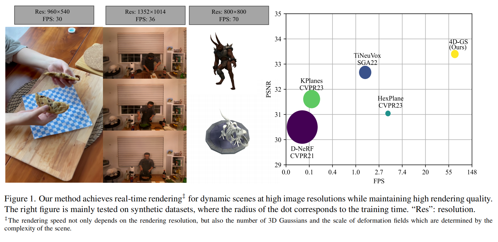

# 4D Gaussian Splatting for Real-Time Dynamic Scene Rendering

## Arxiv Preprint

### [Project Page](https://guanjunwu.github.io/4dgs/index.html)| [Arxiv Paper](https://arxiv.org/abs/2310.08528)

<!-- | [Video](https://youtu.be/sROLfK_VkCk) -->

<!-- [Fast Dynamic Radiance Fields with Time-Aware Neural Voxels](https://jaminfong.cn/tineuvox)    -->
[Guanjun Wu](https://guanjunwu.github.io/)<sup>1*</sup>, [Taoran Yi](https://github.com/taoranyi)<sup>2*</sup>,
[Jiemin Fang](https://jaminfong.cn/)<sup>3</sup>, [Lingxi Xie](http://lingxixie.com/)<sup>3</sup>, </br>[Xiaopeng Zhang](https://sites.google.com/site/zxphistory/)<sup>3</sup>, [Wei Wei](https://www.eric-weiwei.com/)<sup>1</sup>,[Wenyu Liu](http://eic.hust.edu.cn/professor/liuwenyu/)<sup>2</sup>, [Qi Tian](https://scholar.google.com/citations?hl=en&user=61b6eYkAAAAJ)<sup>3</sup> , [Xinggang Wang](https://xinggangw.info/)<sup>2✉</sup>

<sup>1</sup>School of CS, HUST &emsp; <sup>2</sup>School of EIC, HUST &emsp; <sup>3</sup>Huawei Inc. &emsp;

---------------------------------------------------

   
Our method converges very quickly. And achieves real-time rendering speed.


<video width="320" height="240" controls>
  <sourc src="assets/teaservideo.mp4" type="video/mp4">
</video>

<video width="320" height="240" controls>
  <source src="assets/cut_roasted_beef_time.mp4" type="video/mp4">
</video>


## Environmental Setups
Please follow the [3D-GS](https://github.com/graphdeco-inria/gaussian-splatting) to install the relative packages.
```bash
git clone https://github.com/hustvl/4DGaussians --recursive
cd 4DGaussians
conda create -n Gaussians4D python=3.7 
pip install -r requirements.txt
```
In our environment, we use pytorch=1.13.1+cu116
## Data Preparation
**For synthetic scenes:**  
The dataset provided in [D-NeRF](https://github.com/albertpumarola/D-NeRF) is used. You can download the dataset from [dropbox](https://www.dropbox.com/s/0bf6fl0ye2vz3vr/data.zip?dl=0).

**For real dynamic scenes:**  
The dataset provided in [HyperNeRF](https://github.com/google/hypernerf) is used. You can download scenes from [Hypernerf Dataset](https://github.com/google/hypernerf/releases/tag/v0.1) and organize them as [Nerfies](https://github.com/google/nerfies#datasets). Meanwhile, [Plenoptic Dataset](https://github.com/facebookresearch/Neural_3D_Video) could be downloaded from their official websites, to save the memory, you should extract the frames of each video, twhen organize your dataset as follows.
```
├── data
│   | dnerf 
│     ├── mutant
│     ├── standup 
│     ├── ...
│   | hypernerf
│     ├── interp
│     ├── misc
│     ├── virg
│   | dynerf
│     ├── cook_spinach
│       ├── cam00
│           ├── images
│               ├── 0000.png
│               ├── 0001.png
│               ├── 0002.png
│               ├── ...
│       ├── cam01
│           ├── images
│               ├── 0000.png
│               ├── 0001.png
│               ├── ...
│     ├── cut_roasted_beef
|     ├── ...
```


## Training
For training synthetic scenes such as `lego`, run 
``` 
python train.py -s data/dnerf/bouncingballs --port 6017 --expname "dnerf/bouncingballs" --configs arguments/dnerf/bouncingballs.py 
``` 
You can custom your training config through the config files.
## Rendering
Run the following script to render the images.  

```
python render.py --model_path "output/dnerf/bouncingballs/"  --skip_train --configs arguments/dnerf/bouncingballs.py  &
```


## Evaluation
Run the following script to evaluate the model.  

```
python metrics.py --model_path "output/dnerf/bouncingballs/" 
```
## Scripts

There are some helpful scripts in `scripts/`, please feel free to use them.

---

Some source code of ours is borrowed from [3DGS](https://github.com/graphdeco-inria/gaussian-splatting), [k-planes](https://github.com/Giodiro/kplanes_nerfstudio),[HexPlane](https://github.com/Caoang327/HexPlane), [TiNeuVox](https://github.com/hustvl/TiNeuVox). We sincerely appreciate the excellent works of these authors.

## Acknowledgement

We would like to express our sincere gratitude to @zhouzhenghong-gt for his revisions to our code and discussions on the content of our paper.
## Citation
If you find this repository/work helpful in your research, welcome to cite the paper and give a ⭐.
```
@article{wu20234dgaussians,
  title={4D Gaussian Splatting for Real-Time Dynamic Scene Rendering},
  author={Wu, Guanjun and Yi, Taoran and Fang, Jiemin and Xie, Lingxi and Zhang, Xiaopeng and Wei Wei and Liu, Wenyu and Tian, Qi and Wang Xinggang},
  journal={arXiv preprint arXiv:2310.08528},
  year={2023}
}
```