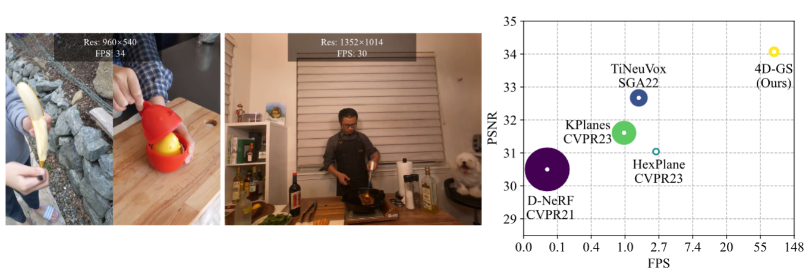

# 4D Gaussian Splatting for Real-Time Dynamic Scene Rendering

## ArXiv Preprint

### [Project Page](https://guanjunwu.github.io/4dgs/index.html)| [arXiv Paper](https://arxiv.org/abs/2310.08528)


[Guanjun Wu](https://guanjunwu.github.io/)<sup>1*</sup>, [Taoran Yi](https://github.com/taoranyi)<sup>2*</sup>,
[Jiemin Fang](https://jaminfong.cn/)<sup>3‡</sup>, [Lingxi Xie](http://lingxixie.com/)<sup>3</sup>, </br>[Xiaopeng Zhang](https://scholar.google.com/citations?user=Ud6aBAcAAAAJ&hl=zh-CN)<sup>3</sup>, [Wei Wei](https://www.eric-weiwei.com/)<sup>1</sup>,[Wenyu Liu](http://eic.hust.edu.cn/professor/liuwenyu/)<sup>2</sup>, [Qi Tian](https://www.qitian1987.com/)<sup>3</sup> , [Xinggang Wang](https://xwcv.github.io)<sup>2‡✉</sup>

<sup>1</sup>School of CS, HUST &emsp; <sup>2</sup>School of EIC, HUST &emsp; <sup>3</sup>Huawei Inc. &emsp;

<sup>\*</sup> Equal Contributions. <sup>$\ddagger$</sup> Project Lead. <sup>✉</sup> Corresponding Author. 

---------------------------------------------------

   
Our method converges very quickly and achieves real-time rendering speed.

Colab demo:[](https://colab.research.google.com/github/hustvl/4DGaussians/blob/master/4DGaussians.ipynb) (Thanks [camenduru](https://github.com/camenduru/4DGaussians-colab).)

Light Gaussian implementation: [This link](https://github.com/pablodawson/4DGaussians) (Thanks [pablodawson](https://github.com/pablodawson))


## Environmental Setups
Please follow the [3D-GS](https://github.com/graphdeco-inria/gaussian-splatting) to install the relative packages.
```bash
git clone https://github.com/hustvl/4DGaussians
cd 4DGaussians
git submodule update --init --recursive
conda create -n Gaussians4D python=3.7 
conda activate Gaussians4D

pip install -r requirements.txt
pip install -e submodules/depth-diff-gaussian-rasterization
pip install -e submodules/simple-knn
```
In our environment, we use pytorch=1.13.1+cu116.
## Data Preparation
**For synthetic scenes:**  
The dataset provided in [D-NeRF](https://github.com/albertpumarola/D-NeRF) is used. You can download the dataset from [dropbox](https://www.dropbox.com/s/0bf6fl0ye2vz3vr/data.zip?dl=0).

**For real dynamic scenes:**  
The dataset provided in [HyperNeRF](https://github.com/google/hypernerf) is used. You can download scenes from [Hypernerf Dataset](https://github.com/google/hypernerf/releases/tag/v0.1) and organize them as [Nerfies](https://github.com/google/nerfies#datasets). Meanwhile, [Plenoptic Dataset](https://github.com/facebookresearch/Neural_3D_Video) could be downloaded from their official websites. To save the memory, you should extract the frames of each video and then organize your dataset as follows.
```
├── data
│   | dnerf 
│     ├── mutant
│     ├── standup 
│     ├── ...
│   | hypernerf
│     ├── interp
│     ├── misc
│     ├── virg
│   | dynerf
│     ├── cook_spinach
│       ├── cam00
│           ├── images
│               ├── 0000.png
│               ├── 0001.png
│               ├── 0002.png
│               ├── ...
│       ├── cam01
│           ├── images
│               ├── 0000.png
│               ├── 0001.png
│               ├── ...
│     ├── cut_roasted_beef
|     ├── ...
```


## Training
For training synthetic scenes such as `bouncingballs`, run 
``` 
python train.py -s data/dnerf/bouncingballs --port 6017 --expname "dnerf/bouncingballs" --configs arguments/dnerf/bouncingballs.py 
``` 
You can customize your training config through the config files.

# Checkpoint
Also, you can training your model with checkpoint.
```python
python train.py -s data/dnerf/bouncingballs --port 6017 --expname "dnerf/bouncingballs" --configs arguments/dnerf/bouncingballs.py --checkpoint_iterations 200 # change it.
```
Then load checkpoint with:
```python
python train.py -s data/dnerf/bouncingballs --port 6017 --expname "dnerf/bouncingballs" --configs arguments/dnerf/bouncingballs.py --start_checkpoint "output/dnerf/bouncingballs/chkpnt_coarse_200.pth"
# finestage: --start_checkpoint "output/dnerf/bouncingballs/chkpnt_fine_200.pth"
```

## Rendering
Run the following script to render the images.  

```
python render.py --model_path "output/dnerf/bouncingballs/"  --skip_train --configs arguments/dnerf/bouncingballs.py  &
```


## Evaluation
You can just run the following script to evaluate the model.  

```
python metrics.py --model_path "output/dnerf/bouncingballs/" 
```
## Custom Datasets
Install nerfstudio and follow their colmap pipeline.

```
pip install nerfstudio
ns-process-data images --data data/your-data --output-dir data/your-ns-data
python train.py -s data/your-ns-data --port 6017 --expname "custom" --configs arguments/hypernerf/default.py 

```

## Scripts

There are some helpful scripts in , please feel free to use them.

`vis_point.py`:
get all points clouds at each timestamps.

usage:
```python
export exp_name="hypernerf"
python vis_point.py --model_path output/$exp_name/interp/aleks-teapot --configs arguments/$exp_name/default.py 
```

`weight_visualization.ipynb`:

visualize the weight of Multi-resolution HexPlane module.

`merge_many_4dgs.py`:
merge your trained 4dgs.
usage:
```python
export exp_name="dynerf"
python merge_many_4dgs.py --model_path output/$exp_name/sear_steak
```

`colmap.sh`:
generate point clouds from input data
```bash
bash colmap.sh data/hypernerf/virg/vrig-chicken hypernerf 
bash colmap.sh data/dynerf/sear_steak llff
```

**Blender** format seems doesn't work. Welcome to raise a pull request to fix it.

`downsample_point.py` :downsample generated point clouds by sfm.
```python
python scripts/downsample_point.py data/dynerf/sear_steak/colmap/dense/workspace/fused.ply data/dynerf/sear_steak/points3D_downsample2.ply
```
In my paper, I always use `colmap.sh` to generate dense point clouds and downsample it to less than 40000 points.

Here are some codes maybe useful but never adopted in my paper, you can also try it.

---
## Contributions

**This project is still under development. Please feel free to raise issues or submit pull requests to contribute to our codebase.**

---
Some source code of ours is borrowed from [3DGS](https://github.com/graphdeco-inria/gaussian-splatting), [k-planes](https://github.com/Giodiro/kplanes_nerfstudio),[HexPlane](https://github.com/Caoang327/HexPlane), [TiNeuVox](https://github.com/hustvl/TiNeuVox). We sincerely appreciate the excellent works of these authors.

## Acknowledgement

We would like to express our sincere gratitude to [@zhouzhenghong-gt](https://github.com/zhouzhenghong-gt/) for his revisions to our code and discussions on the content of our paper.
## Citation
Some insights about neural voxel grids and dynamic scenes reconstruction originate from [TiNeuVox](https://github.com/hustvl/TiNeuVox). If you find this repository/work helpful in your research, welcome to cite these papers and give a ⭐. 
```
@article{wu20234dgaussians,
  title={4D Gaussian Splatting for Real-Time Dynamic Scene Rendering},
  author={Wu, Guanjun and Yi, Taoran and Fang, Jiemin and Xie, Lingxi and Zhang, Xiaopeng and Wei Wei and Liu, Wenyu and Tian, Qi and Wang Xinggang},
  journal={arXiv preprint arXiv:2310.08528},
  year={2023}
}

@inproceedings{TiNeuVox,
  author = {Fang, Jiemin and Yi, Taoran and Wang, Xinggang and Xie, Lingxi and Zhang, Xiaopeng and Liu, Wenyu and Nie\ss{}ner, Matthias and Tian, Qi},
  title = {Fast Dynamic Radiance Fields with Time-Aware Neural Voxels},
  year = {2022},
  booktitle = {SIGGRAPH Asia 2022 Conference Papers}
}
```
