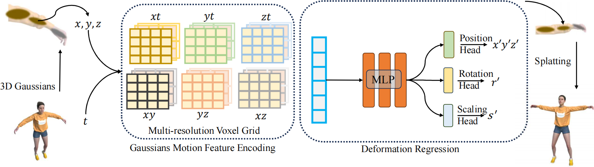
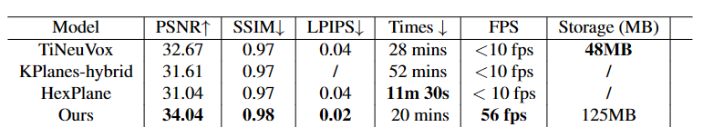

# 4D-GS: Fast Dynamic Gaussians for Real-Time Rendering

## [Project page](https://ingra14m.github.io/Deformable-3D-Gaussians.github.io/) | [Paper](https://arxiv.org/abs/2309.13101)


This repository contains the official implementation associated with the paper 4D-GS: Fast Dynamic Gaussians for Real-Time Rendering". 


## Dataset

In our paper, we use synthetic dataset from [D-NeRF](https://www.albertpumarola.com/research/D-NeRF/index.html) and real dataset from [Hyper-NeRF](https://hypernerf.github.io/), [Neural_3D_Video](https://github.com/facebookresearch/Neural_3D_Video)


## Pipeline




## Results

### D-NeRF Dataset

**Quantitative Results**




The source code of ours is mainly borrowed from [3DGS](https://github.com/graphdeco-inria/gaussian-splatting),
[k-planes](https://sarafridov.github.io/K-Planes/), [HexPlane](https://caoang327.github.io/HexPlane/),
[TiNeuVox](https://jaminfong.cn/tineuvox/), [Deformable3DGS](https://github.com/ingra14m/Deformable-3D-Gaussians
)We sincerely appreciate the excellent work of these authors.

## BibTex

```
@article{yang2023deformable3dgs,
    title={Deformable 3D Gaussians for High-Fidelity Monocular Dynamic Scene Reconstruction},
    author={Yang, Ziyi and Gao, Xinyu and Zhou, Wen and Jiao, Shaohui and Zhang, Yuqing and Jin, Xiaogang},
    journal={arXiv preprint arXiv:2309.13101},
    year={2023}
}
```