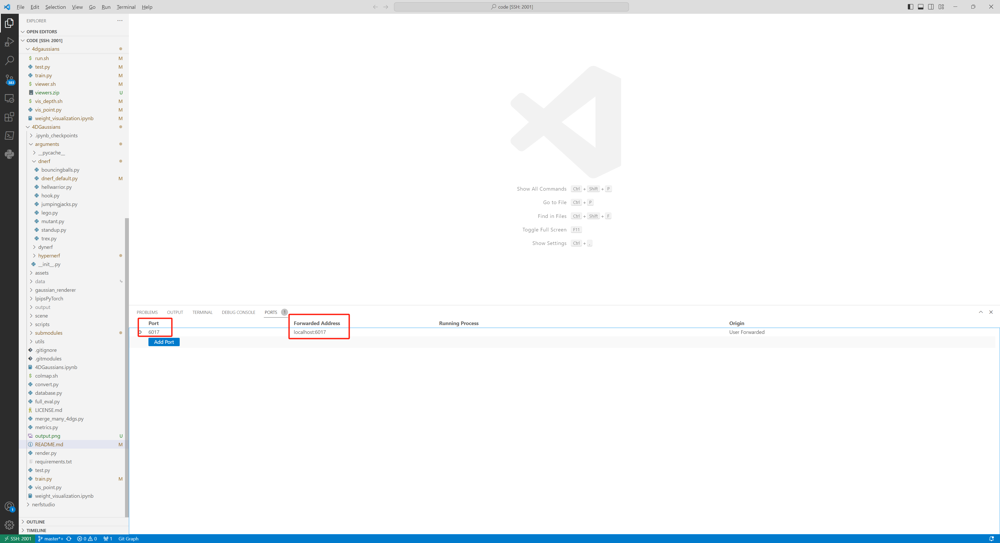

# 4D Gaussian Splatting
The viewer is downloads from [3D-GS](https://repo-sam.inria.fr/fungraph/3d-gaussian-splatting/binaries/viewers.zip), you can extract the zip file under the folder of 4D-GS like:
```
├── 4DGaussians
|   |viewers
|      ├── bin
|      ├── resources
|      ├── shaders
|      |...
|   | train.py
|   | test.py
|   | ...(other files)
```
## How to use viewer?
If you train the 4D-GS on locally:
```python
./viewers/bin/SIBR_remoteGaussian_app.exe --port 6017 # port should be same with your trainging code.
```
If you train the 4D-GS on the server, you should add a port forward, in VSCode, like this:

Then you could clone this repo on your personal computer, and download a D-NeRF dataset, like this:
```
├── 4DGaussians
|   |viewers
|      ├── bin
|      ├── resources
|      ├── shaders
|      |...
│   | data 
│     ├── dnerf
|   | train.py
|   | test.py
|   | ...(other files)
```
And the rendering speed may mainly depends on your network bandwidth.
